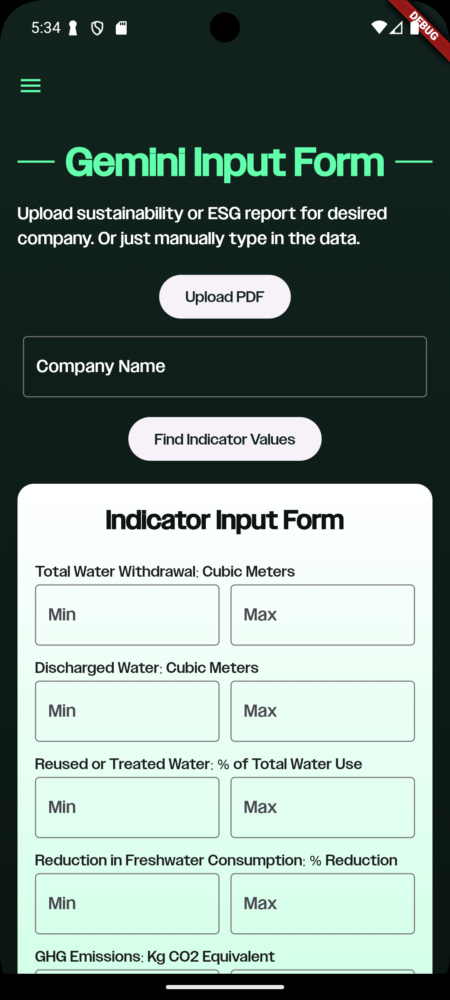
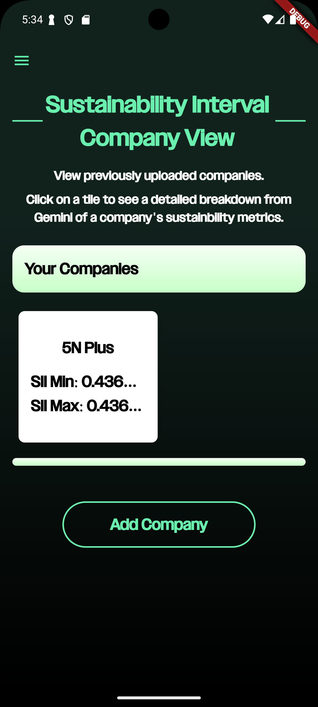
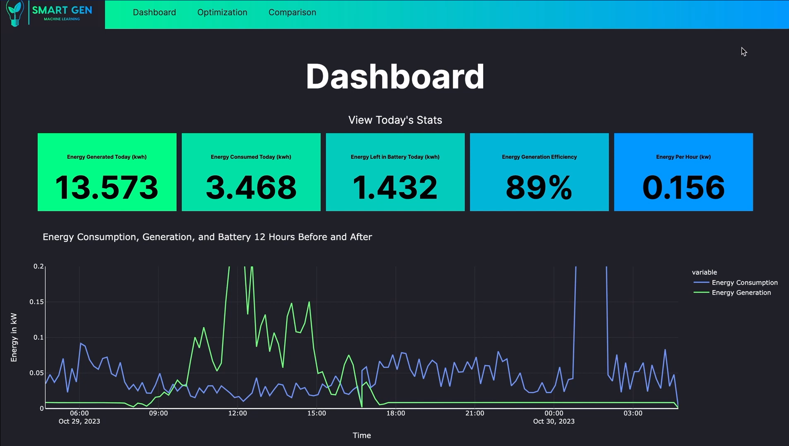

# Programming Projects Portfolio

---

## Sustainability/Environment Projects

### GreenGrade - Fuzzy Analysis of Company Sustainability/ESG Reports (2024)
[GreenGrade](https://github.com/KOL305/GreenGrade) [[Demo Video]](https://drive.google.com/file/d/144YSIiQVfv4mO7qh6bYnb1NyxOYBt7jo/view?usp=sharing)
 

For the 2024 Google Gemini API Competition, used fuzzy logic to determine a company's sustainability interval index, using a customizable set of parameters, given data from sustainability and ESG reports scraped manually or through the Gemini API. Through a mobile app, outputs a score and breakdown analysis, aiming to allow policymakers to determine a company's true sustainability through a mathematical and algorithmic process. Users can view all their logged companies through a dashboard, allowing for easy comparison between companies.

---
### SmartGen - Optimization of Home Electricity Usage and Consumption (2023)
[SmartGen Machine Learning](https://github.com/KOL305/smart-gen) [[Demo Video]](https://youtu.be/Aekci3r5V8A?si=KYZFIJLS2oHUSIPP)

For the 2023 Congressional App Challenge, built a web application designed to help homeowners reduce energy usage by informing users of their energy generation and consumption patterns. Users can see daily energy usage and consumption statistics on their dashboard, using LightGBM Gradient-boosting Decision Trees to make regression predictions to help users see predicted energy usage. OpenAI GPT 3.5 Turbo generates energy-saving recommendations tailored to the user's energy usage distribution, and homeowners can see predicted energy-saving statistics to continue being mindful of their energy consumption.

---
### Overhaul - Educating Gamers About Overfishing Through a Fishery Management Sim (2023)
[Overhaul](https://github.com/KOL305/overhaul)

For the 2023 San Ramon Hackathon (3rd Place Winner), developed a web-based fishery simulator that taught players the dangers and causes of overfishing through managing their own fishery. Random in-game events, such as rapid eutrophication, would cause players to decide between overfishing their pond or being unable to pay rent. Instructional messages accompanied events to reinforce the learning experience.

---

## Productivity/Utility Projects

---
### Task Manager With Slimes - Gamifying Productivity with Customizable Avatars (2022)
[Task Manager with Slimes](https://github.com/KOL305/task-manager-with-slimes)

For the 2022 San Ramon Hackathon (2nd Place Winner), created a web application that combined the features of a standard task manager (to-do list, deadlines, etc.) with a customizable slime avatar. By completing tasks, users gained coins, which were used to purchase accessories and decorations for their slimes. A dashboard displays their metrics and enables users to better understand their work patterns.

---

---
### Word Cloud - Web-based GUI for Generating Word Clouds (2022)
[Word Cloud](https://github.com/KOL305/word-cloud)

For the 2022 AT&T Junior Labs Hackathon (2nd Place Winner), created a web-based word cloud generator GUI that gave users two options to create word clouds: client-side using custom Javascript code or server-side using the Python wordclouds library.

---

---
### Cloud Nine - All-in-one Web-based Sleep Cycle Tracker and Helper (2022)
[Cloud Nine](https://github.com/KOL305/cloud-nine)

For the 2022 TeenTech SF Hackathon (Finalist), built a web application that enabled users to log and track sleep patterns and sleep cycles, informing them to make better sleep decisions. Users could also access sleep help tools such as a white noise collection or drawing pad.

---

---
### Nutrimood - Making Nutrition Fun with Animated Pets (2022)
[Nutrimood Server](https://github.com/KOL305/nutrimood-server) & [Nutrimood Mobile App](https://github.com/KOL305/nutrimood-mobile) [[Demo Video]](https://drive.google.com/file/d/1vtqJMKKQ9kR_QasBJNJIcKIkQYfMwH3V/view?usp=sharing)

For the 2022 Congressional App Challenge, utilized the USDA Food Data Central to create a calorie and macronutrient tracker mobile app. Used animated sprites to reflect the dietary habits of the users, with the health and mood of the pet dependent on the calorie and nutrient intake choices of the user.

---

---
### GeoRepair - Platform for Community-reported Infrastructure Issues (2021)
[GeoRepair](https://github.com/KOL305/geo-repair)

For the 2021 YoungWonks Open Source Project, developed an application with both a web-based and mobile application that enabled users to take photos and geotag broken and damaged infrastructure around their neighborhood. A social media platform enables community members to upvote posts and leave comments, and an administrative dashboard visualizes all reported issues geographically so that authorities can create an efficient response.

---

---

Page template forked from <a href="https://github.com/evanca/quick-portfolio">evanca</a>

<!-- Remove above link if you don't want to attibute -->
